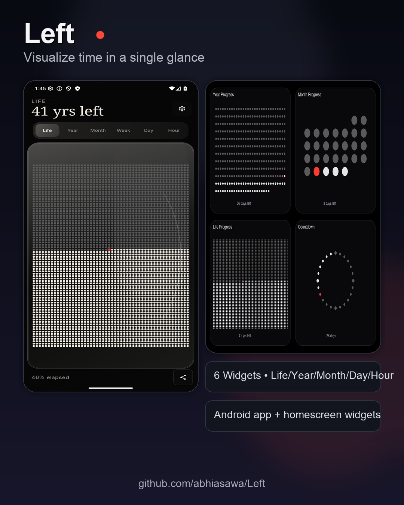

# Left (TimeLeft)

Left is a visual-first Android app for people who want to *feel* time passing, not just read numbers.

Track your life, year, month, week, day, and hour with clean dot-based visuals and home screen widgets.

Inspired by Tim Urban's "Your Life in Weeks" and [Left - Widgets for Time Left](https://apps.apple.com/app/left-days-of-the-year/id1533146565).

## Why Left

- Visual over numeric: no clutter, no charts, no spreadsheets
- Fast daily check-in: open app or glance at widgets
- Personal and customizable: symbols, colors, active hours, countdowns
- Built for homescreen habits: widgets that update and deep-link into the app

## App Preview

| Year | Life |
|---|---|
|  |  |

| Month | Week |
|---|---|
|  |  |

## Social Poster (Instagram)



## Widget Preview

| Year Progress (2x2) | Month Progress (2x2) |
|---|---|
|  |  |

| Life Progress (2x2) | Countdown (2x2) |
|---|---|
|  |  |

| Day / Hour (2x2) | Year Barcode (4x2) |
|---|---|
|  |  |

Also included as share-ready collages:

- 
- 

## Install In 2 Minutes (Recommended)

### Requirements

- Android Studio (Ladybug/Hedgehog+)
- Android SDK + Platform Tools
- JDK 17
- Android device or emulator (API 26+)

### One-command install (device/emulator connected)

```bash
./gradlew :app:installDebug
```

This command builds and installs the app directly to your connected Android device/emulator.

## Build APK

```bash
./gradlew :app:assembleDebug
```

APK output:

```text
app/build/outputs/apk/debug/app-debug.apk
```

Install manually:

```bash
adb install -r app/build/outputs/apk/debug/app-debug.apk
```

## Run From Android Studio

1. Open this folder in Android Studio.
2. Let Gradle sync.
3. Select an emulator/device.
4. Click **Run**.

## Core Product Features

- Life/year/month/week/day/hour visual timelines
- Real-time "current moment" marker
- Swipe between time units
- 7 symbol styles (dot, star, heart, hexagon, square, diamond, number)
- Custom color themes for elapsed/remaining/current indicators
- Share snapshots
- Daily reminders + milestone detection
- Configurable wake/sleep window for day/hour views

## Tech Stack

- Kotlin + Jetpack Compose + Material 3
- Glance AppWidget
- Room + DataStore
- WorkManager
- Min SDK 26 / Target SDK 34

## Project Structure

```text
app/src/main/java/com/timeleft/
├── data/
├── domain/
├── navigation/
├── ui/
├── util/
├── widgets/
├── MainActivity.kt
└── TimeLeftApplication.kt
```

## License

MIT
