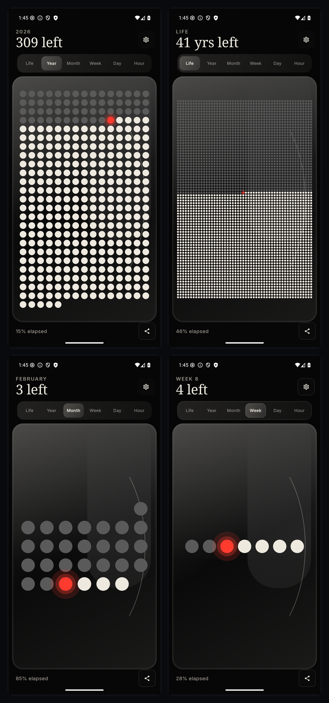

<h1 align="center">Left</h1>

<p align="center">
  <strong>See your time as a living visual — not a number.</strong>
</p>

<p align="center">
  Left is an Android app that turns your life, year, month, week, day, and hour into clean visual timelines and homescreen widgets.
</p>

<p align="center">
  <a href="#install-in-60-seconds">Install</a> ·
  <a href="#why-people-love-left">Why Left</a> ·
  <a href="#screenshots">Screenshots</a> ·
  <a href="#widgets">Widgets</a> ·
  <a href="#for-developers">For Developers</a>
</p>

<p align="center">
  
  
  
  
</p>

---

## Install In 60 Seconds

Use this on your Android phone:

- **[Download APK (v1.0.0)](https://github.com/abhiasawa/Left/raw/main/downloads/TimeLeft-v1.0.0-debug.apk)**

Quick steps:

1. Tap the APK link and download.
2. Open it from the Downloads app.
3. Allow install permission if Android asks.
4. Tap **Install**.

APK file in repo:

- [downloads/TimeLeft-v1.0.0-debug.apk](downloads/TimeLeft-v1.0.0-debug.apk)

---

## Why People Love Left

- **Instant clarity**: understand time at a glance without charts or clutter
- **Visual-first design**: progress is represented as dots, rings, and barcodes
- **Homescreen friendly**: widgets keep time awareness visible all day
- **Deeply personal**: customize symbols, themes, active hours, and countdowns

Inspired by Tim Urban's "Your Life in Weeks" and [Left - Widgets for Time Left](https://apps.apple.com/app/left-days-of-the-year/id1533146565).

---

## Screenshots

<p align="center">
  
</p>

---

## Widgets

<p align="center">
  
</p>

Included widgets:

- Year Progress (2x2)
- Year Barcode (4x2)
- Month Progress (2x2)
- Life Progress (2x2)
- Countdown (2x2)
- Day / Hour (2x2)

---

## Core Product Features

- Life / Year / Month / Week / Day / Hour timelines
- Real-time "current moment" indicator
- Smooth swipe navigation across time units
- 7 symbol styles: dot, star, heart, hexagon, square, diamond, number
- Custom elapsed / remaining / current colors
- Snapshot sharing
- Daily reminders with milestone detection
- Configurable wake/sleep windows

---

## For Developers

```bash
./gradlew :app:installDebug
```

Build APK only:

```bash
./gradlew :app:assembleDebug
```

Tech stack:

- Kotlin + Jetpack Compose + Material 3
- Glance AppWidget
- Room + DataStore
- WorkManager
- Min SDK 26 / Target SDK 34

Project structure:

```text
app/src/main/java/com/timeleft/
├── data/
├── domain/
├── navigation/
├── ui/
├── util/
├── widgets/
├── MainActivity.kt
└── TimeLeftApplication.kt
```

## License

MIT
